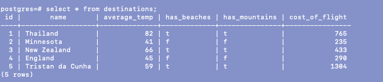

# sql-checkpoint
CHALLENGE 1
Query: 
Results: 

CHALLENGE 2
Query: 
Results: 

CHALLENGE 3
Query: 
Results: 

CHALLENGE 4
Query: 
Results: 

CHALLENGE 5
Query: 
Results: 

CHALLENGE 6
Query: 
Results: 

CHALLENGE 7
Query: 
Results: 

CHALLENGE 8
Query: 
Results: 

CHALLENGE 9
Query: 
Results: 

CHALLENGE 10
Query: 
Results: 

CHALLENGE 11
Query: 
Results: 

CHALLENGE 12
Query: 
Results: 

CHALLENGE 13
Query: 
Results: 